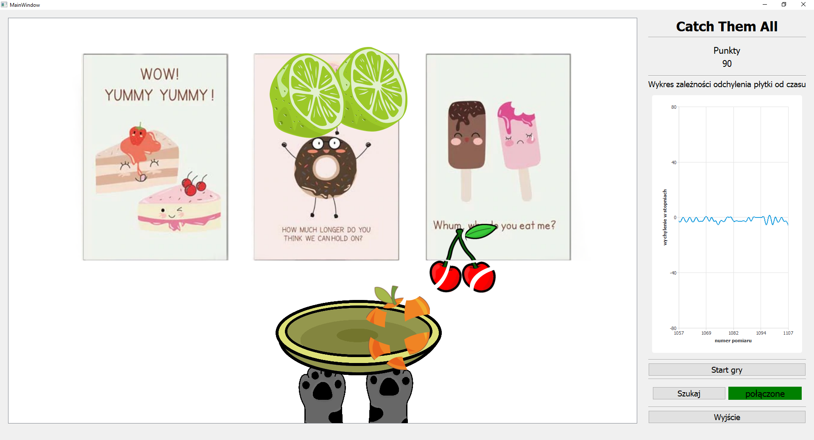
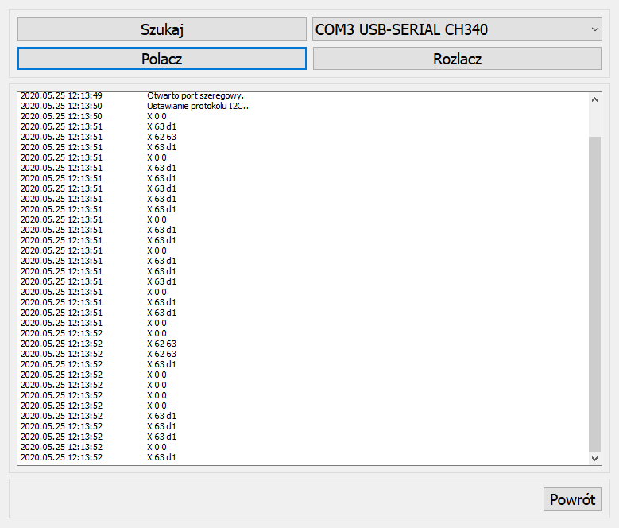
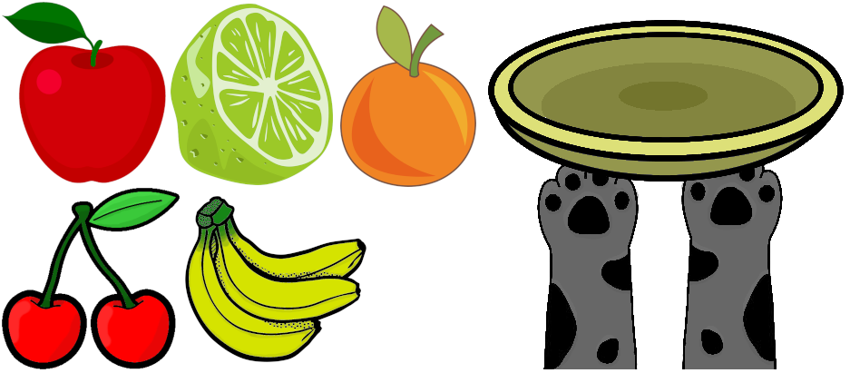

# Catch Them All
Game "Catch Them All" created in the QT and C++ language.

## Project description
In the application is option to connect controler with accelerometer.

On the right of the application window is shown graph when the controller is connected. On graph is shown controller deflection angle.

The player is on bottom of game window and is presented as paws with plane. Moving the player is possible by tilting the controller. A larger deflection angle corresponds to faster moving of player.

The game is about colecting "fruits" thats fall down. When fruit is colected it falls apart and falls down faster.

