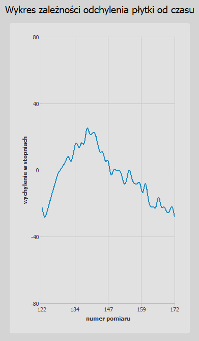

# Catch Them All
Game "Catch Them All" was created in the QT and C++ language.

## Project description
In the application is an option to connect the controller with the accelerometer.

On the right of the application window is shown a graph of when the controller is connected. On graph is shown the controller deflection angle.

The player is on the bottom of the game window and is presented as paws with a plane. Moving the player is possible by tilting the controller. A larger deflection angle corresponds to the faster moving of the player.

The game is about collecting "fruits" that fall. When fruit is collected it falls apart and falls faster.

